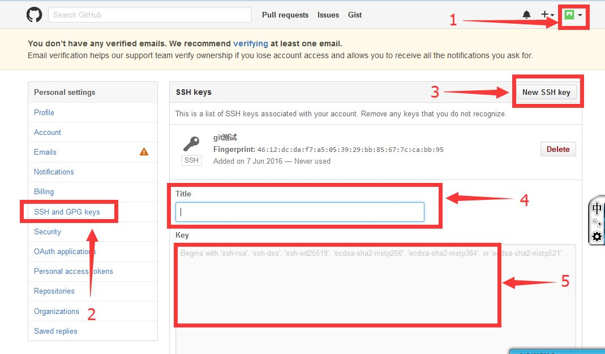

#Git分布式版本控制

##1.1Git诞生历史

>很多人都知道，Linus在1991年创建了开源的Linux，从此，Linux系统不断发展，已经成为最大的服务器系统软件了。

>Linus虽然创建了Linux，但Linux的壮大是靠全世界热心的志愿者参与的，这么多人在世界各地为Linux编写代码，那Linux的代码是如何管理的呢？

>事实是，在2002年以前，世界各地的志愿者把源代码文件通过diff的方式发给Linus，然后由Linus本人通过手工方式合并代码！

>你也许会想，为什么Linus不把Linux代码放到版本控制系统里呢？不是有CVS、SVN这些免费的版本控制系统吗？因为Linus坚定地反对CVS和SVN，这些集中式的版本控制系统不但速度慢，而且必须联网才能使用。有一些商用的版本控制系统，虽然比CVS、SVN好用，但那是付费的，和Linux的开源精神不符。

>不过，到了2002年，Linux系统已经发展了十年了，代码库之大让Linus很难继续通过手工方式管理了，社区的弟兄们也对这种方式表达了强烈不满，于是Linus选择了一个商业的版本控制系统BitKeeper，BitKeeper的东家BitMover公司出于人道主义精神，授权Linux社区免费使用这个版本控制系统。

>安定团结的大好局面在2005年就被打破了，原因是Linux社区牛人聚集，不免沾染了一些梁山好汉的江湖习气。开发Samba的Andrew试图破解BitKeeper的协议（这么干的其实也不只他一个），被BitMover公司发现了（监控工作做得不错！），于是BitMover公司怒了，要收回Linux社区的免费使用权。

>Linus可以向BitMover公司道个歉，保证以后严格管教弟兄们，嗯，这是不可能的。实际情况是这样的：

>Linus花了两周时间自己用C写了一个分布式版本控制系统，这就是Git！一个月之内，Linux系统的源码已经由Git管理了！牛是怎么定义的呢？大家可以体会一下。

>Git迅速成为最流行的分布式版本控制系统，尤其是2008年，GitHub网站上线了，它为开源项目免费提供Git存储，无数开源项目开始迁移至GitHub，包括jQuery，PHP，Ruby等等。

>历史就是这么偶然，如果不是当年BitMover公司威胁Linux社区，可能现在我们就没有免费而超级好用的Git了。

####集中式版本控制系统
>先说集中式版本控制系统，版本库是集中存放在中央服务器的，而干活的时候，用的都是自己的电脑，所以要先从中央服务器取得最新的版本，然后开始干活，干完活了，再把自己的活推送给中央服务器。中央服务器就好比是一个图书馆，你要改一本书，必须先从图书馆借出来，然后回到家自己改，改完了，再放回图书馆。

  
集中式版本控制系统

####分布式版本控制系统
>分布式版本控制系统根本没有“中央服务器”，每个人的电脑上都是一个完整的版本库，这样，你工作的时候，就不需要联网了，因为版本库就在你自己的电脑上。既然每个人电脑上都有一个完整的版本库，那多个人如何协作呢？比方说你在自己电脑上改了文件A，你的同事也在他的电脑上改了文件A，这时，你们俩之间只需把各自的修改推送给对方，就可以互相看到对方的修改了。
>
>和集中式版本控制系统相比，分布式版本控制系统的安全性要高很多，因为每个人电脑里都有完整的版本库，某一个人的电脑坏掉了不要紧，随便从其他人那里复制一个就可以了。而集中式版本控制系统的中央服务器要是出了问题，所有人都没法干活了。

  
分布式版本控制系统

>
>在正式使用前，我们还需要弄清楚Git的三种重要模式，分别是已提交、已修改、已暂存
>
>已提交(committed):表示数据文件已经顺利提交到Git数据库中。
>
>已修改(modified):表示数据文件已经被修改，但未被保存到Git数据库中。
>
>已暂存(staged):表示数据文件已经被修改，并会在下次提交时提交到Git数据库中。
>
>提交前的数据文件可能会被随意修改或丢失，但只要把文件快照顺利提交到Git数据库中，那就可以完全放心了，流程为：

>1.在工作目录中修改数据文件。
>
>2.将文件的快照放入暂存区域。
>
>3.将暂存区域的文件快照提交到Git仓库中。
>

##Git环境准备
#####centos6版本：
	[root@iZ258nxl1nwZ ~]# cat /etc/redhat-release  #查看系统版本
	CentOS release 6.5 (Final)
	[root@iZ258nxl1nwZ ~]# uname -r  #查看内核版本
	2.6.32-431.23.3.el6.x86_64
	[root@iZ258nxl1nwZ ~]# getenforce  #确认Selinux关闭状态
	Disabled
	[root@iZ258nxl1nwZ ~]# /etc/init.d/iptables status  #要关闭防火墙
	iptables: Firewall is not running.

##Git安装
#####centos6版本：
Git是分布式的版本控制系统，我们只要有了一个原始Git版本仓库，就可以让其他主机克隆走这个原始版本仓库，从而使得一个Git版本仓库可以被同时分布到不同的主机之上，并且每台主机的版本库都是一样的，没有主次之分，极大的保证了数据安全性，并使得用户能够自主选择向那个Git服务器推送文件了，其实部署一个git服务器是非常简单的。

1. 安装git包  
	[root@iZ258nxl1nwZ ~]# yum install -y git  
2. 初始化仓库  
	[root@iZ258nxl1nwZ ~]# git config  --global user.name "ren"  #配置git使用用户  
	[root@iZ258nxl1nwZ ~]# git config  --global user.email "315420700@qq.com"  #配置git使用者的邮箱  
	[root@iZ258nxl1nwZ ~]# git config  --global color.ui true  #给git增加颜色  
	[root@iZ258nxl1nwZ ~]# git config --list  #检查git的刚刚配置的参数
	user.name=ren  
	user.email=315420700@qq.com  
	color.ui=true
######Git常用命令
	add         #添加文件内容至索引  
	bisect  #通过二分查找定位引入 bug 的变更  
	branch     #列出、创建或删除分支  
	checkout   #检出一个分支或路径到工作区  
	clone  #克隆一个版本库到一个新目录  
	commit  #记录变更到版本库  
	diff  #显示提交之间、提交和工作区之间等的差异  
	fetch  #从另外一个版本库下载对象和引用  
	grep  #输出和模式匹配的行  
	init  #创建一个空的 Git 版本库或重新初始化一个已存在的版本库  
	log  #显示提交日志  
	merge  #合并两个或更多开发历史  
	mv  #移动或重命名一个文件、目录或符号链接  
	pull  #获取并合并另外的版本库或一个本地分支  
	push  #更新远程引用和相关的对象  
	rebase  #本地提交转移至更新后的上游分支中  
	reset  #重置当前HEAD到指定状态  
	rm  #从工作区和索引中删除文件  
	show  #显示各种类型的对象  
	status  #显示工作区状态  
	tag  #创建、列出、删除或校验一个GPG签名的 tag 对象

##Git基本操作
#####Git提交数据
>创建一个版本库非常简单，首先，选择一个合适的地方，创建一个空目录，也就是工作区（Working Directory）
>
>我们可以简单的把工作目录理解成是一个被Git服务程序管理的目录，Git会时刻的追踪目录内文件的改动，另外在安装好了Git服务程序后，默认就会创建好了一个叫做master的分支，我们直接可以提交数据到了
>
>什么是版本库呢？版本库又名仓库，英文名repository，你可以简单理解成一个目录，这个目录里面的所有文件都可以被Git管理起来，每个文件的修改、删除，Git都能跟踪，以便任何时刻都可以追踪历史，或者在将来某个时刻可以“还原”，是工作区的隐藏目录.git这个目录。
>
>Git的版本库里存了很多东西，其中最重要的就是称为stage（或者叫index）的暂存区，还有Git为我们自动创建的第一个分支master，以及指向master的一个指针叫HEAD。
>

  

	[root@iZ258nxl1nwZ ~]# mkdir /gitdata  #创建git工作目录  
	[root@iZ258nxl1nwZ ~]# cd /gitdata/  进入git工作目录  
	[root@iZ258nxl1nwZ gitdata]# git init  #初始化git的工作目录  
	Initialized empty Git repository in /gitdata/.git/  
	[root@iZ258nxl1nwZ gitdata]# echo "this is xiaozai git" >Readme.txt  #创建一个文件  
	[root@iZ258nxl1nwZ gitdata]# git status  #查看git的工作区状态  
	On branch master  
	Initial commit  
	Untracked files:  
	(use "git add <file>..." to include in what will be committed)  
	Readme.txt  #发现了新建立的文件，并以红底显示这个文件  
	nothing added to commit but untracked files present (use "git add" to track)  
	[root@iZ258nxl1nwZ gitdata]# git add Readme.txt  #git添加文件至暂存区  
	[root@iZ258nxl1nwZ gitdata]# git status  #再次查看状态  
	# On branch master
	#
	# Initial commit
	#
	# Changes to be committed:
	#   (use "git rm --cached <file>..." to unstage)
	#
	#       new file:   Readme.txt  #发现新建立的文件readme.txt已经变绿
	[root@iZ258nxl1nwZ gitdata]# git commit -m "this is first version"  #git commit提交暂存文件至git版本仓库
	[master (root-commit) eb3ec9e] this is first version  
	1 files changed, 1 insertions(+), 0 deletions(-)  
	create mode 100644 Readme.txt  

#####Git比较数据
>git diff适用于上次修改文件后，add到暂存区但是没有提交。
>然后再修改的时候，可以比较和暂存区的文件内容有哪些不同

	[root@iZ258nxl1nwZ gitdata]# git diff readme.txt 
	diff --git a/readme.txt b/readme.txt
	index 5d656f3..5bb36a5 100644
	--- a/readme.txt
	+++ b/readme.txt
	@@ -1,2 +1,3 @@
	 this in node1 test
	 this is test
	+this is test3
	
	#git diff HEAD -- readme.txt命令可以查看工作区和版本库里面最新版本的区别
	[root@iZ258nxl1nwZ gitdata]# git diff HEAD -- readme.txt
	diff --git a/readme.txt b/readme.txt
	index 1dea128..5bb36a5 100644
	--- a/readme.txt
	+++ b/readme.txt
	@@ -1,5 +1,3 @@
	-11111
	 this in node1 test
	-dsfhsh
	-ddddddd
	-sdlkfjslj
	+this is test
	+this is test3
	
	#和上一个版本库的readme.txt进行比较
	[root@iZ258nxl1nwZ gitdata]# git diff HEAD^^ -- readme.txt
	diff --git a/readme.txt b/readme.txt
	index ec8d39e..5bb36a5 100644
	--- a/readme.txt
	+++ b/readme.txt
	@@ -1,2 +1,3 @@
	-11111
	 this in node1 test
	+this is test
	+this is test3
#####Git撤销修改
	#修改文件
	[root@iZ258nxl1nwZ gitdata]# vim readme.txt 
	this in node1 test
	this is test
	this is test3
	this ist test4
	~             
	[root@iZ258nxl1nwZ gitdata]# git status #查看状态，发现：Git会告诉你，git checkout -- file可以丢弃工作区的修改
	# On branch master
	# Changes to be committed:
	#   (use "git reset HEAD <file>..." to unstage)
	#
	#       modified:   readme.txt
	#
	# Changed but not updated:
	#   (use "git add <file>..." to update what will be committed)
	#   (use "git checkout -- <file>..." to discard changes in working directory)
	#
	#       modified:   readme.txt
	#

>命令git checkout -- readme.txt意思就是，把readme.txt文件在工作区的修改全部撤销，这里有两种情况：
>
>一种是readme.txt自修改后还没有被放到暂存区，现在，撤销修改就回到和版本库一模一样的状态；
>
>一种是readme.txt已经添加到暂存区后，又作了修改，现在，撤销修改就回到添加到暂存区后的状态。
>
>总之，就是让这个文件回到最近一次git commit或git add时的状态。
>git checkout -- file命令中的--很重要，没有--，就变成了“切换到另一个分支”的命令

	[root@iZ258nxl1nwZ gitdata]# git checkout -- readme.txt 
	[root@iZ258nxl1nwZ gitdata]# git status
	# On branch master
	# Changes to be committed:
	#   (use "git reset HEAD <file>..." to unstage)
	#
	#       modified:   readme.txt
	#
	[root@iZ258nxl1nwZ gitdata]# cat readme.txt 
	this in node1 test
	this is test
	this is test3

#####Git移除数据
>有些时候会向把已经添加到暂存区的文件移除，但仍然希望文件在工作目录中不丢失，换句话说，就是把文件从追踪清单中删除。  
>usage:  
	git rm [options] [--] <file>...  
		-n, --dry-run         dry run  
		-q, --quiet           be quiet  
		--cached              only remove from the index  
		-f, --force           override the up-to-date check  
		-r                    allow recursive removal  
		--ignore-unmatch      exit with a zero status even if nothing matched  

	[root@iZ258nxl1nwZ gitdata]# touch test.txt  #创建测试文件  
	[root@iZ258nxl1nwZ gitdata]# git add test.txt  #git添加文件至暂存区  
	[root@iZ258nxl1nwZ gitdata]# git status  #查看git的工作区状态  
	# On branch master
	# Changes to be committed:
	#   (use "git reset HEAD <file>..." to unstage)
	#
	#       new file:   test.txt
	#
	[root@iZ258nxl1nwZ gitdata]# git rm --cached test.txt   #仅仅是将文件从git暂存区域的追踪列表移除，不会删除当前工作目录内的数据文件)  
	rm 'test.txt'
	[root@iZ258nxl1nwZ gitdata]# git status  #查看git的工作区状态，此文件已经是未追踪的状态  
	# On branch master
	# Untracked files:
	#   (use "git add <file>..." to include in what will be committed)
	#
	#       test.txt
	nothing added to commit but untracked files present (use "git add" to track)  
	
	#如果想将文件数据从git暂存区和工作目录一起删除，可以做如下操作。  
	[root@iZ258nxl1nwZ gitdata]# git add test.txt  #将test文件提交到git暂存区  
	[root@iZ258nxl1nwZ gitdata]# ls  查看下目录下的文件  
	Readme.txt  test.txt  
	[root@iZ258nxl1nwZ gitdata]# git rm test.txt  #删除这个文件，会提示报错，要么强制移除要么只把暂存区里的移除  
	error: 'test.txt' has changes staged in the index  
	(use --cached to keep the file, or -f to force removal)  
	[root@iZ258nxl1nwZ gitdata]# git status  
	# On branch master  
	# Changes to be committed:  
	#   (use "git reset HEAD <file>..." to unstage)  
	#  
	#       new file:   test.txt  
	#  
	[root@iZ258nxl1nwZ gitdata]# git rm -f test.txt  #强制移除  
	rm 'test.txt'  
	[root@iZ258nxl1nwZ gitdata]# ls  #发现实体物理test.txt被删除了  
	Readme.txt  
	[root@iZ258nxl1nwZ gitdata]# git status  #查看是否暂存区还有没？发现已经没有什么被更新未提交的文件来提交了  
	# On branch master  
	nothing to commit (working directory clean)  

#####Git移动数据
	[root@iZ258nxl1nwZ gitdata]# git mv Readme.txt readme.txt  ##git如果要修改文件名称,则使用git mv命令
	[root@iZ258nxl1nwZ gitdata]# ll
	total 4
	-rw-r--r-- 1 root root 20 Jun  2 16:50 readme.txt
	[root@iZ258nxl1nwZ gitdata]# git status
	# On branch master
	# Changes to be committed:
	#   (use "git reset HEAD <file>..." to unstage)
	#
	#       renamed:    Readme.txt -> readme.txt	  #可以看见下次提交会有一个修改名字的操作
	#
	[root@iZ258nxl1nwZ gitdata]# git commit -m "rename readme.txt"  #提交到git仓库
	[master 26dc5d7] rename readme.txt
	 1 files changed, 0 insertions(+), 0 deletions(-)
	 rename Readme.txt => readme.txt (100%)
	[root@iZ258nxl1nwZ gitdata]# git status  #查看git的工作区状态
	# On branch master
	nothing to commit (working directory clean)
	[root@iZ258nxl1nwZ gitdata]# 

#####Git历史记录
	[root@iZ258nxl1nwZ gitdata]# git log  #查看提交历史记录
	commit 26dc5d7da1512f2b965117ad07a3548f002cf2c2
	Author: ren <315420700@qq.com>
	Date:   Thu Jun 2 17:40:36 2016 +0800
	
	    rename readme.txt
	
	commit eb3ec9ee154204e8720170c31e24ddbbc61ff141
	Author: ren <315420700@qq.com>
	Date:   Thu Jun 2 16:57:04 2016 +0800
	
	    this is first version
	[root@iZ258nxl1nwZ gitdata]# git log -1  #只查看最近1条记录
	commit 26dc5d7da1512f2b965117ad07a3548f002cf2c2
	Author: ren <315420700@qq.com>
	Date:   Thu Jun 2 17:40:36 2016 +0800
	
	    rename readme.txt

	[root@iZ258nxl1nwZ gitdata]# git log -p -3 #查看每次提交的内容差异，如果后面不接数字就是查看全部，接几就是看最近几次的
	commit 26dc5d7da1512f2b965117ad07a3548f002cf2c2
	Author: ren <315420700@qq.com>
	Date:   Thu Jun 2 17:40:36 2016 +0800
	
	    rename readme.txt

	diff --git a/Readme.txt b/Readme.txt
	deleted file mode 100644
	index 05f0c6c..0000000
	--- a/Readme.txt
	+++ /dev/null
	@@ -1 +0,0 @@
	-this is xiaozai git
	diff --git a/readme.txt b/readme.txt
	new file mode 100644
	index 0000000..05f0c6c
	--- /dev/null
	+++ b/readme.txt
	@@ -0,0 +1 @@
	+this is xiaozai git
	
	commit eb3ec9ee154204e8720170c31e24ddbbc61ff141
	Author: ren <315420700@qq.com>
	Date:   Thu Jun 2 16:57:04 2016 +0800
	
	    this is first version
	
	diff --git a/Readme.txt b/Readme.txt
	new file mode 100644
	index 0000000..05f0c6c
	--- /dev/null
	+++ b/Readme.txt
	@@ -0,0 +1 @@
	+this is xiaozai git
	[root@iZ258nxl1nwZ gitdata]# git log --stat -1  #stat简要显示数据增改行数，这样能够看到提交中修改过的内容，对文件添加或移动的行数，并在最后列出所有增减行的概要信息
	commit bbfffec1980f97f8e780af554eff8750232c7696
	Author: ren <315420700@qq.com>
	Date:   Thu Jun 2 17:47:30 2016 +0800
	
	    this is third change
	
	 readme.txt |    2 +-
	 1 files changed, 1 insertions(+), 1 deletions(-)
	
	[root@iZ258nxl1nwZ gitdata]# git log --pretty=full  #-–pretty根据不同的格式展示提交的历史信息
	commit bbfffec1980f97f8e780af554eff8750232c7696
	Author: ren <315420700@qq.com>
	Commit: ren <315420700@qq.com>
	
	    this is third change
	
	commit 26dc5d7da1512f2b965117ad07a3548f002cf2c2
	Author: ren <315420700@qq.com>
	Commit: ren <315420700@qq.com>
	
	    rename readme.txt
	
	commit eb3ec9ee154204e8720170c31e24ddbbc61ff141
	Author: ren <315420700@qq.com>
	Commit: ren <315420700@qq.com>
	
>	pretty的格式
>	this is first version  
>	--pretty[=<format>], --format[=<format>]  
>	Pretty-print the contents of the commit logs in a given format, where  
>	<format> can be one of oneline, short, medium, full, fuller, email, raw  
>	and format:<string>. When omitted, the format defaults to medium.  
>	
	#使用format参数来指定具体的输出格式
	%s  提交说明。
	%cd 提交日期。
	%an 作者的名字。
	%cn 提交者的姓名。
	%ce 提交者的电子邮件。
	%H  提交对象的完整SHA-1哈希字串。
	%h  提交对象的简短SHA-1哈希字串。
	%T  树对象的完整SHA-1哈希字串。
	%t  树对象的简短SHA-1哈希字串。
	%P  父对象的完整SHA-1哈希字串。
	%p  父对象的简短SHA-1哈希字串。
	%ad 作者的修订时间。
	[root@iZ258nxl1nwZ gitdata]# git log --pretty=fromat:" %an : %s" #查看当前记录的作者和提交说明
	fromat: ren : this is third change
	fromat: ren : rename readme.txt
	fromat: ren : this is first version

#####Git还原数据
	[root@iZ258nxl1nwZ gitdata]# cat readme.txt  #查看现在第3次提交后文件的内容
	11111
	[root@iZ258nxl1nwZ gitdata]# git log --pretty=oneline  #提交的历史信息
	bbfffec1980f97f8e780af554eff8750232c7696 this is third change
	26dc5d7da1512f2b965117ad07a3548f002cf2c2 rename readme.txt
	eb3ec9ee154204e8720170c31e24ddbbc61ff141 this is first version

>Git服务程序中有一个叫做HEAD的版本指针，当用户申请还原数据时，其实就是将HEAD指针指向到某个特定的提交版本，但是因为Git是分布式版本控制系统，为了避免历史记录冲突，故使用了SHA-1计算出十六进制的哈希字串来区分每个提交版本，另外默认的HEAD版本指针会指向到最近的一次提交版本记录，而上一个提交版本会叫HEAD^，上上一个版本则会叫做HEAD^^，当然一般会用HEAD~3来表示往上数第3个提交版本。

	[root@iZ258nxl1nwZ gitdata]# git reset --hard HEAD~1  #还原历史第一次提交的版本
	HEAD is now at 26dc5d7 rename readme.txt
	[root@iZ258nxl1nwZ gitdata]# cat readme.txt 
	this is xiaozai git

>刚刚的操作实际上就是改变了一下HEAD版本指针的位置，就是你将HEAD指针放在那里，那么你的当前工作版本就会定位在那里，要想把内容再还原到最新提交的版本，先看查看下提交版本号

	[root@iZ258nxl1nwZ gitdata]# git log --pretty=oneline
	26dc5d7da1512f2b965117ad07a3548f002cf2c2 rename readme.txt
	eb3ec9ee154204e8720170c31e24ddbbc61ff141 this is first version

>发现最近的第3个版本没有了，因为我们当前的工作版本是历史的一个提交点，这个历史提交点还没有发生过第3次的更新记录，所以当然就看不到了，要是想“还原到未来”的历史更新点，可以用git reflog命令来查看所有的历史记录：

	[root@iZ258nxl1nwZ gitdata]# git reflog  ##查看未来历史更新点
	eb3ec9e HEAD@{0}: HEAD~1: updating HEAD
	26dc5d7 HEAD@{1}: HEAD~1: updating HEAD
	bbfffec HEAD@{2}: commit: this is third change
	26dc5d7 HEAD@{3}: commit: rename readme.txt
	[root@iZ258nxl1nwZ gitdata]# git log --pretty=oneline  #发现只剩下滴一个版本了，顺便找到历史还原点的SHA-1值
	eb3ec9ee154204e8720170c31e24ddbbc61ff141 this is first version
	[root@iZ258nxl1nwZ gitdata]# git reflog
	eb3ec9e HEAD@{0}: HEAD~1: updating HEAD
	26dc5d7 HEAD@{1}: HEAD~1: updating HEAD
	bbfffec HEAD@{2}: commit: this is third change
	26dc5d7 HEAD@{3}: commit: rename readme.txt
	[root@iZ258nxl1nwZ gitdata]# git reset --hard bbfffec  ##找到历史还原点的SHA-1值后，就可以还原(值不写全,系统会自动匹配)，还原到第3个版本
	HEAD is now at bbfffec this is third change
	[root@iZ258nxl1nwZ gitdata]# git reflog
	bbfffec HEAD@{0}: bbfffec: updating HEAD
	eb3ec9e HEAD@{1}: HEAD~1: updating HEAD
	26dc5d7 HEAD@{2}: HEAD~1: updating HEAD
	bbfffec HEAD@{3}: commit: this is third change
	26dc5d7 HEAD@{4}: commit: rename readme.txt
	[root@iZ258nxl1nwZ gitdata]# git log --pretty=oneline
	bbfffec1980f97f8e780af554eff8750232c7696 this is third change
	26dc5d7da1512f2b965117ad07a3548f002cf2c2 rename readme.txt
	eb3ec9ee154204e8720170c31e24ddbbc61ff141 this is first version
	
	#如是只是想把某个文件内容还原，就不必这么麻烦，直接用git checkout命令就可以的
	[root@iZ258nxl1nwZ gitdata]# echo "hello">>readme.txt  #添加一段话
	[root@iZ258nxl1nwZ gitdata]# cat readme.txt 
	11111
	hello
	[root@iZ258nxl1nwZ gitdata]# git checkout -- readme.txt  #恢复
	[root@iZ258nxl1nwZ gitdata]# cat readme.txt             
	11111
	#如果暂存区中有该文件，则直接从暂存区恢复，如果暂存区没有该文件，则将还原成最近一次文件提交时的快照。

##Git管理分支结构

>分支即是平行空间，假设你在为某个手机系统研发拍照功能，代码已经完成了80%，但如果将这不完整的代码直接提交到git仓库中，又有可能影响到其他人的工作，此时我们便可以在该软件的项目之上创建一个名叫“拍照功能”的分支，这种分支只会属于你自己，而其他人看不到，等代码编写完成后再与原来的项目主分支合并下即可，这样即能保证代码不丢失，又不影响其他人的工作。

>一般在实际的项目开发中，我们要尽量保证master分支是非常稳定的，仅用于发布新版本，平时不要随便直接修改里面的数据文件，而工作的时候则可以新建不同的工作分支，等到工作完成后在合并到master分支上面，所以团队的合作分支看起来会像上面图那样。

#####Git创建分支

	[root@iZ258nxl1nwZ gitdata]# git branch node1  #创建分支
	[root@iZ258nxl1nwZ gitdata]# git checkout node1   #切换分支
	Switched to branch 'node1'  
	[root@iZ258nxl1nwZ gitdata]# git branch  #查看当前分支情况,当前分支前有*号
	  master
	* node1
	[root@iZ258nxl1nwZ gitdata]# echo "this in node1 test">>readme.txt  #给文件加点东西
	[root@iZ258nxl1nwZ gitdata]# cat readme.txt 
	11111
	this in node1 test
	[root@iZ258nxl1nwZ gitdata]# git add readme.txt  #提交到暂存区
	[root@iZ258nxl1nwZ gitdata]# git status
	# On branch node1
	# Changes to be committed:
	#   (use "git reset HEAD <file>..." to unstage)
	#
	#       modified:   readme.txt
	#
	[root@iZ258nxl1nwZ gitdata]# git commit -m "node1 test"  ##提交的git仓库
	[node1 1a7af69] node1 test
	 1 files changed, 1 insertions(+), 0 deletions(-)
	[root@iZ258nxl1nwZ gitdata]# git checkout master  #切换到主分支
	Switched to branch 'master'
	[root@iZ258nxl1nwZ gitdata]# cat readme.txt  #发现切换回来数据变回来了
	11111
	[root@iZ258nxl1nwZ gitdata]# ll
	total 4
	-rw-r--r-- 1 root root 6 Jun  2 18:28 readme.txt
	[root@iZ258nxl1nwZ gitdata]# cat readme.txt 
	11111
	[root@iZ258nxl1nwZ gitdata]# git checkout node1  #切换回node1分支
	Switched to branch 'node1'
	[root@iZ258nxl1nwZ gitdata]# ll
	total 4
	-rw-r--r-- 1 root root 25 Jun  2 18:29 readme.txt
	[root@iZ258nxl1nwZ gitdata]# cat readme.txt   #发现切换回来后，文件的内容也被切换回来了
	11111
	this in node1 test

#####Git合并分支
	[root@iZ258nxl1nwZ gitdata]# cat readme.txt  #查看文件
	11111
	this in node1 test
	[root@iZ258nxl1nwZ gitdata]# 
	[root@iZ258nxl1nwZ gitdata]# git branch  #查看分支，*号在哪里表示当前处在哪个分支上
	  master
	* node1
	[root@iZ258nxl1nwZ gitdata]# git checkout master  #切换到主分支上
	Switched to branch 'master'
	[root@iZ258nxl1nwZ gitdata]# git branch         
	* master
	  node1
	[root@iZ258nxl1nwZ gitdata]# git branch node1   #分支已存在所以无法创建，注意这里是创建分支的命令
	fatal: A branch named 'node1' already exists.
	[root@iZ258nxl1nwZ gitdata]# git merge node1  #合并node1分支到master分支上
	Updating bbfffec..1a7af69
	Fast-forward
	 readme.txt |    1 +
	 1 files changed, 1 insertions(+), 0 deletions(-)
	[root@iZ258nxl1nwZ gitdata]# cat readme.txt  #查看合并后的文件内容
	11111
	this in node1 test
	[root@iZ258nxl1nwZ gitdata]# git branch -d node1  #确认了分支已经合并到从分支了，可以将从分支删除
	Deleted branch node1 (was 1a7af69).
	[root@iZ258nxl1nwZ gitdata]# git branch  #删除后，查看branch，只剩下master分支
	* master

#####Git分支冲突
	[root@iZ258nxl1nwZ gitdata]# git checkout -b node2  #创建分支并切换到这个分支上,-b参数表示创建并切换
	Switched to a new branch 'node2'
	[root@iZ258nxl1nwZ gitdata]# git branch  #查看分支
	  master
	* node2
	[root@iZ258nxl1nwZ gitdata]# vim readme.txt  #修改文件
	11111
	this in node1 test
	siljfldsjfds
	dsfkljasdlfj                          
	"readme.txt" 5L, 61C written                                                 
	[root@iZ258nxl1nwZ gitdata]# git add readme.txt  #添加到暂存区
	[root@iZ258nxl1nwZ gitdata]# git commit -m "xiugai"  #提交到git仓库
	[node2 0697e32] xiugai
	 1 files changed, 3 insertions(+), 0 deletions(-)
	[root@iZ258nxl1nwZ gitdata]# git checkout master  #切换到主分支
	Switched to branch 'master'
	[root@iZ258nxl1nwZ gitdata]# git branch  #检查是否切换到主分支
	* master
	  node2
	[root@iZ258nxl1nwZ gitdata]# vim readme.txt  #修改主分支的内容
	11111
	this in node1 test
	dsfhsh
	sdfsf
	ddddddd
	~         
	"readme.txt" 5L, 46C written        
	[root@iZ258nxl1nwZ gitdata]# git add readme.txt  #添加到暂存区
	[root@iZ258nxl1nwZ gitdata]# git commit -m "xiugai master"  #提交到git仓库
	[master 8a9a051] xiugai master
	 1 files changed, 3 insertions(+), 0 deletions(-)
	[root@iZ258nxl1nwZ gitdata]# git merge node2  #合并分支，发现合并失败，有冲突
	Auto-merging readme.txt
	CONFLICT (content): Merge conflict in readme.txt
	Automatic merge failed; fix conflicts and then commit the result.

	[root@iZ258nxl1nwZ gitdata]# cat readme.txt  #发现文件里面多了很多东西，需要手工把不一致的地方修改
	11111
	this in node1 test
	<<<<<<< HEAD
	dsfhsh
	sdfsf
	ddddddd
	=======
	siljfldsjfds
	dsfkljasdlfj
	sdlkfjslj
	>>>>>>> node2
	#Git用< <<<<<<，=======，>>>>>>>分割开了各个分支冲突的内容，我们需要手工的删除这些符号，并将内容修改
	[root@iZ258nxl1nwZ gitdata]# git add readme.txt  #重新提交到暂存区
	[root@iZ258nxl1nwZ gitdata]# git commit -m "fix"  #重新提交到git仓库
	[master acc1a32] fix
	[root@iZ258nxl1nwZ gitdata]# git branch -d node2  #删除分支
	Deleted branch node2 (was 0697e32).
	[root@iZ258nxl1nwZ gitdata]# git branch  #查看分支
	* master
	[root@iZ258nxl1nwZ gitdata]# git log --pretty=oneline  #查看历史版本
	acc1a322a0d83395e47b1b65cd524e48b6e11b9c fix
	8a9a05180be9f8d147c17dc9d5fec3c307f970f3 xiugai master
	0697e32d683a200bf84e1caffc849bdfda2c3089 xiugai
	1a7af690a31311f8b489f3c7c2600643a4536f2d node1 test
	bbfffec1980f97f8e780af554eff8750232c7696 this is third change
	26dc5d7da1512f2b965117ad07a3548f002cf2c2 rename readme.txt
	eb3ec9ee154204e8720170c31e24ddbbc61ff141 this is first version

>当Git无法自动合并分支时，就必须首先解决冲突。解决冲突后，再提交，合并完成。
>
>用git log --graph命令可以看到分支合并图

#####Git管理标签
>当版本仓库内的数据有个大的改善或者功能更新，我们经常会打一个类似于软件版本号的标签，这样通过标签就可以将版本库中的某个历史版本给记录下来，方便我们随时将特定历史时期的数据取出来用，另外打标签其实只是像某个历史版本做了一个指针，所以一般都是瞬间完成的。

	[root@iZ258nxl1nwZ gitdata]# git tag V1.0  #当前提交内容打一个标签(方便快速回滚)
	[root@iZ258nxl1nwZ gitdata]# git tag   #查看当前所有的标签
	V1.0
	[root@iZ258nxl1nwZ gitdata]# git show V1.0  #查看当前1.0版本的详细信息
	commit acc1a322a0d83395e47b1b65cd524e48b6e11b9c
	Merge: 8a9a051 0697e32
	Author: ren <315420700@qq.com>
	Date:   Thu Jun 2 18:49:33 2016 +0800
	
	    fix
	
	diff --cc readme.txt
	index 7c474fd,29a8ad0..1dea128
	--- a/readme.txt
	+++ b/readme.txt
	@@@ -1,5 -1,5 +1,5 @@@
	  11111
	  this in node1 test
	 -siljfldsjfds
	 -dsfkljasdlfj
	 +dsfhsh
	- sdfsf
	 +ddddddd
	+ sdlkfjslj
	[root@iZ258nxl1nwZ gitdata]# git tag v1.1 -m "v1.1 create"  #创建带有说明的标签,-a指定标签名字，-m指定说明文字
	[root@iZ258nxl1nwZ gitdata]# git tag  #查看当前所有的标签
	V1.0
	v1.1
	[root@iZ258nxl1nwZ gitdata]# git tag -d v1.1  #删除标签
	Deleted tag 'v1.1' (was ff0e9d4)
	[root@iZ258nxl1nwZ gitdata]# git tag
	V1.0

#####GitLab安装部署
	[root@iZ258nxl1nwZ xiaozaidata]# yum install curl openssh-server postfix -y
	[root@iZ258nxl1nwZ ~]# curl -sS https://packages.gitlab.com/install/repositories/gitlab/gitlab-ce/script.rpm.sh|bash
	[root@iZ258nxl1nwZ ~]# yum install gitlab-ce -y

#####Git和github远程仓库
>第1步：创建SSH Key。在用户主目录下，看看有没有.ssh目录，如果有，再看看这个目录下有没有id_rsa和id_rsa.pub这两个文件，如果已经有了，可直接跳到下一步。如果没有，打开Shell（Windows下打开Git Bash），创建SSH Key
>
>如果一切顺利的话，可以在用户主目录里找到.ssh目录，里面有id_rsa和id_rsa.pub两个文件，这两个就是SSH Key的秘钥对，id_rsa是私钥，不能泄露出去，id_rsa.pub是公钥，可以放心地告诉任何人。
>

	[root@iZ258nxl1nwZ gitdata]# ssh-keygen -t rsa -C "315420700@qq.com"
	Generating public/private rsa key pair.
	Enter file in which to save the key (/root/.ssh/id_rsa): 
	/root/.ssh/id_rsa already exists.
	Overwrite (y/n)? y
	Enter passphrase (empty for no passphrase): 
	Enter same passphrase again: 
	Your identification has been saved in /root/.ssh/id_rsa.
	Your public key has been saved in /root/.ssh/id_rsa.pub.
	The key fingerprint is:
	46:12:dc:da:f7:a5:05:39:29:bb:85:67:7c:ca:bb:95 315420700@qq.com
	The key's randomart image is:
	+--[ RSA 2048]----+
	|     ...     o   |
	|      ... . =    |
	|      .o.  = o   |
	|      .o. + = +  |
	|        S. B *   |
	|       .  . =  . |
	|             .E  |
	|            ..   |
	|            ..   |
	+-----------------+

>第2步：登陆GitHub，打开“Account settings”，“SSH Keys”页面：
>

  

>然后，点“NEW SSH Key”，填上任意Title，在Key文本框里粘贴id_rsa.pub文件的内容(我已经把下方的key里面修改了，别想通过我的key干坏事！)：
>

	[root@iZ258nxl1nwZ gitdata]# cat /root/.ssh/id_rsa.pub 
	ssh-rsa AAAAB3NzaC1952EAAAABIwAAAQEAx13MuNF2q+85bwnupVI+r97OU+EOZlLbvavOTXZ9u66rSmSntdjf5MQI5vF/OOGJib7oZS421CzIpHDS8Olz5SHinePJQP+/AI22ld65VNYAb+6w+BMuq0qv9tyPZG3nRX+wher7ehTOkHpAfjStoVlSuSmEvtyyMMKj58tmBxpnYM245p5VxTjGil5OpQ9AtSJvSrFgWfSJCjH7ew1d+4ZgGgV042FMYZXHUvnWWyDL3DooZCBo/2ikp9rw/FaE0paecBVhDauWHW5/VQptSNrCuApVRGddZsDzJWvNyunRodSkqecR2k1v/iH4yQIzoSghtFkmr7tXfCjPFitKQ== 315420700@qq.com

  

>为什么GitHub需要SSH Key呢？因为GitHub需要识别出你推送的提交确实是你推送的，而不是别人冒充的，而Git支持SSH协议，所以，GitHub只要知道了你的公钥，就可以确认只有你自己才能推送。
>
>当然，GitHub允许你添加多个Key。假定你有若干电脑，你一会儿在公司提交，一会儿在家里提交，只要把每台电脑的Key都添加到GitHub，就可以在每台电脑上往GitHub推送了。
>
>最后友情提示，在GitHub上免费托管的Git仓库，任何人都可以看到喔（但只有你自己才能改）。所以，不要把敏感信息放进去。

---

>登陆GitHub，然后，到你的主页这里，创建一个新的仓库：
>

  

>在Repository name填入你想填的git仓库的名字，其他保持默认设置，点击“Create repository”按钮，就成功地创建了一个新的Git仓库：
>

  

>目前，在GitHub上的这个learngit仓库还是空的，GitHub告诉我们，可以从这个仓库克隆出新的仓库，也可以把一个已有的本地仓库与之关联，然后，把本地仓库的内容推送到GitHub仓库。
>

  

  

>建完库后，github就已经给出了你如何下一步的操作，注意要选择是从http还是ssh的方式。
>添加后，远程库的名字就是origin，这是Git默认的叫法，也可以改成别的，但是origin这个名字一看就知道是远程库。

	[root@iZ258nxl1nwZ /]# mkdir /git-doc
	[root@iZ258nxl1nwZ /]# cd /git-doc/
	[root@iZ258nxl1nwZ git-doc]# echo "# git-doc" >> README.md
	[root@iZ258nxl1nwZ git-doc]# git init
	Initialized empty Git repository in /git-doc/.git/
	[root@iZ258nxl1nwZ git-doc]# git add README.md
	[root@iZ258nxl1nwZ git-doc]# git commit -m "first commit"
	[master (root-commit) 9f394a4] first commit
	 1 files changed, 1 insertions(+), 0 deletions(-)
	 create mode 100644 README.md
	[root@iZ258nxl1nwZ git-doc]# git remote add origin git@github.com:REN-I/git-doc.git
	[root@iZ258nxl1nwZ git-doc]# git push -u origin master
	The authenticity of host 'github.com (192.30.252.122)' can't be established.
	RSA key fingerprint is 16:27:ac:a5:76:28:2d:36:63:1b:56:4d:eb:df:a6:48.
	Are you sure you want to continue connecting (yes/no)? yes
	Warning: Permanently added 'github.com,192.30.252.122' (RSA) to the list of known hosts.
	Counting objects: 3, done.
	Writing objects: 100% (3/3), 213 bytes, done.
	Total 3 (delta 0), reused 0 (delta 0)
	To git@github.com:REN-I/git-doc.git
	 * [new branch]      master -> master
	Branch master set up to track remote branch master from origin.

>把本地库的内容推送到远程，用git push命令，实际上是把当前分支master推送到远程。
>
>由于远程库是空的，我们第一次推送master分支时，加上了-u参数，Git不但会把本地的master分支内容推送的远程新的master分支，还会把本地的master分支和远程的master分支关联起来，在以后的推送或者拉取时就可以简化命令。
>
>推送成功后，可以立刻在GitHub页面中看到远程库的内容已经和本地一模一样：
>

  

>从现在起，只要本地作了提交，就可以通过命令：
>
>git push origin master
>
>注意推送会发生一个小告警，你需要在hosts文件里面添加github网站的解析

	[root@iZ258nxl1nwZ git-doc]# git push origin master
	Warning: Permanently added the RSA host key for IP address '192.30.252.129' to the list of known hosts.
	Everything up-to-date
	[root@iZ258nxl1nwZ git-doc]# echo "192.30.252.130 github.com" >> /etc/hosts
	
	[root@iZ258nxl1nwZ git-doc]# git push origin master                       
	Everything up-to-date

>要关联一个远程库，使用命令git remote add origin git@server-name:path/repo-name.git；
>
>关联后，使用命令git push -u origin master第一次推送master分支的所有内容；
>
>此后，每次本地提交后，只要有必要，就可以使用命令git push origin master推送最新修改；

#####Git和多人协作
	[root@iZ258nxl1nwZ git-doc]# git remote  #查看远程库的信息
	origin
	[root@iZ258nxl1nwZ git-doc]# git remote -v #显示更详细的信息
	origin  git@github.com:REN-I/git-doc.git (fetch)
	origin  git@github.com:REN-I/git-doc.git (push)
>推送分支
>
>推送分支，就是把该分支上的所有本地提交推送到远程库。推送时，要指定本地分支，这样，Git就会把该分支推送到远程库对应的远程分支上：
>
>git push origin master
>
>如果要推送其他分支，比如dev，就改成：
>git push origin dev

#####Git创建标签

